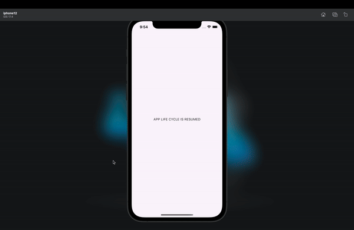

# AppLifecycleListenerExample

This Flutter project demonstrates the use of `AppLifecycleListener` to handle various app lifecycle states and transitions. The app logs and displays the current lifecycle state, updating the UI accordingly.

## Getting Started

### Prerequisites

- Flutter SDK: [Install Flutter](https://flutter.dev/docs/get-started/install)

### Installation

1. Clone the repository:
    ```sh
    git clone <repository_url>
    ```
2. Navigate to the project directory:
    ```sh
    cd AppLifecycleListenerExample
    ```
3. Get the dependencies:
    ```sh
    flutter pub get
    ```

### Running the App

1. Connect a device or start an emulator.
2. Run the app:
    ```sh
    flutter run
    ```

## App Structure

- `main.dart`: The main entry point of the application.
- `AppLifecycleListenerExample`: The main widget that sets up the `MaterialApp` and home screen.
- `AppLifecycleDisplay`: A stateful widget that listens to app lifecycle events and updates the UI accordingly.
- `_AppLifecycleDisplayState`: The state class that handles lifecycle transitions and state changes.

## Features

- Listens to app lifecycle events such as `show`, `resume`, `hide`, `inactive`, `pause`, `detach`, and `restart`.
- Logs lifecycle events using the `log` function.
- Displays the current lifecycle state on the screen.

## Output

The following image shows the output of the app:



## Contributing

Contributions are welcome! Please open an issue or submit a pull request for any improvements or bug fixes.

## License

This project is licensed under the MIT License - see the [LICENSE](LICENSE) file for details.
